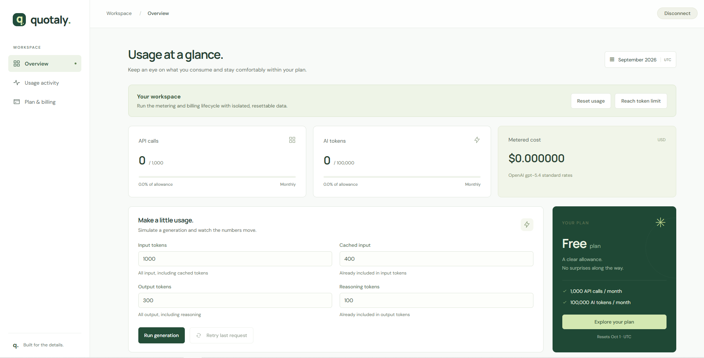

# Quotaly: LLM Usage Metering & Billing Service

A MERN stack usage metering and billing application built with **React**, **Express**, and **MongoDB Atlas**. Visitors can open a workspace, record simulated API and token usage, see monthly limits in action, reset their usage, and try a Stripe test checkout.

The Express backend follows a **modular route, service, and repository structure**. Metering writes, idempotency records, quota counters, and subscription state are persisted in MongoDB.

Transactions keep each successful generation and its usage totals consistent, while repeated idempotency keys return the original result instead of charging usage twice.

The React app uses reusable components, each with its own styles. It connects to the backend through a shared API client. A temporary token stored in the browser tab keeps your workspace available when you reload the page.



## API reference

The app uses `/api` endpoints. Opening a workspace gives the browser a temporary token for subsequent requests.

| Method | Endpoint | Purpose | Access |
| --- | --- | --- | --- |
| `GET` | `/health` | Check API and database availability | Public |
| `GET` | `/api/sandbox/session` | Check whether a workspace session is active | Public |
| `POST` | `/api/sandbox/session` | Open or resume a workspace | Public |
| `DELETE` | `/api/sandbox/session` | Close the current workspace, if active | Public |
| `POST` | `/api/sandbox/reset` | Reset usage in the current workspace | Bearer token |
| `GET` | `/api/usage` | Read the current month's usage, limits, and plan | Bearer token |
| `GET` | `/api/events` | Read recent successful usage events | Bearer token |
| `POST` | `/api/generate` | Record a simulated generation and enforce quotas | Bearer token |
| `POST` | `/api/billing/checkout` | Create a Stripe test Checkout session | Bearer token |
| `POST` | `/api/webhooks/stripe` | Receive a signed Stripe webhook | Stripe signature |

To record usage, send input and output token counts to `POST /api/generate` with a unique **Idempotency-Key**. The key prevents retries from being counted twice.

## Running it locally

**Install dependencies**

Use Node.js 24 and npm.

```bash
npm ci --prefix server
npm ci --prefix web
```

**Configure the server**

Copy the environment template:

```bash
cp server/.env.example server/.env
```

PowerShell users can run:

```powershell
Copy-Item server/.env.example server/.env
```

Set the values in `server/.env`.

**Start the server**

```bash
npm run dev --prefix server
```

**Start the client**

Copy `web/.env.example` to `web/.env`. Its `VITE_API_URL` points to the local server by default. In a second terminal:

```bash
npm run dev --prefix web
```

Open **http://127.0.0.1:5173** in your browser. The API runs on **http://127.0.0.1:3000**.

Select **Open Workspace** to start. It expires automatically and does not require an account or an API key.

## License

This project is licensed under the [MIT](LICENSE) License.
